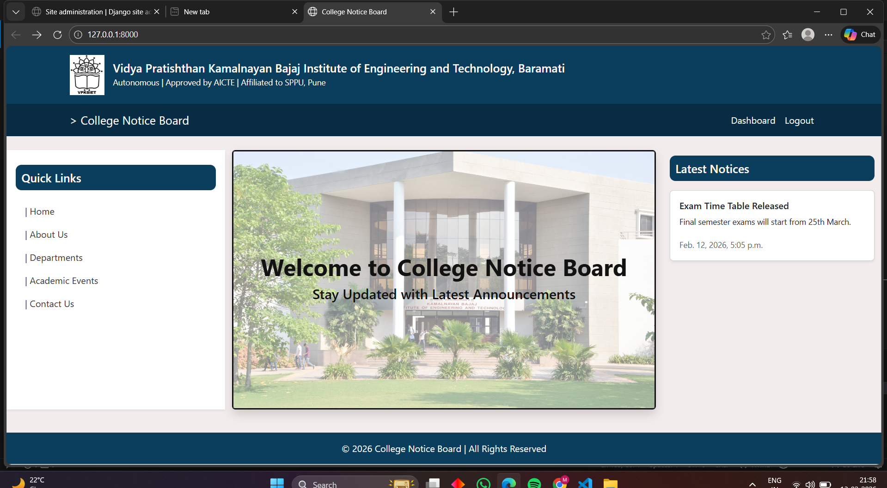
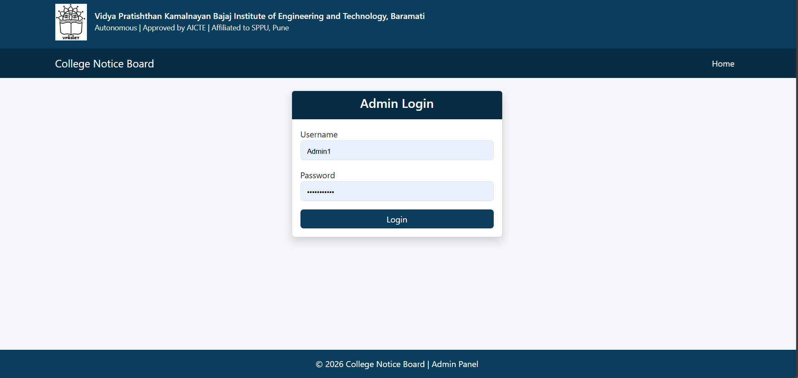
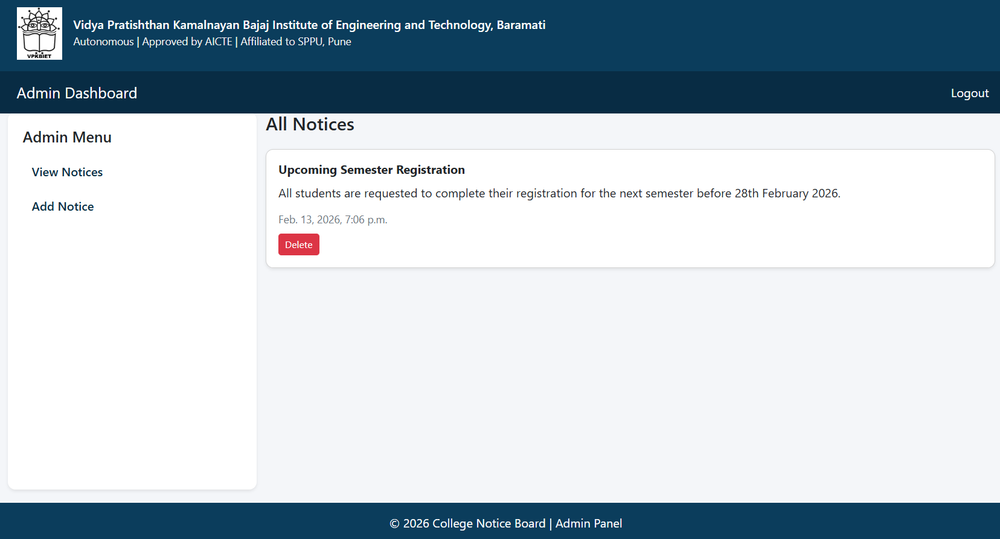
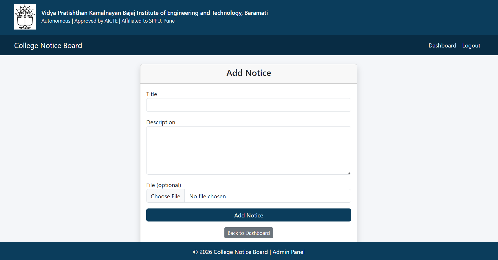

# 📢 College Notice Board – Django Web Application

A dynamic web application built using **Django (Python Framework)** that allows administrators to post notices and students to view them in a structured and user-friendly interface.

This project demonstrates backend development, database integration, and Django MVC architecture.

---

## 🚀 Live Demo
(Add deployed link here if deployed)

---

## 🛠️ Technologies Used

- Python 3
- Django
- HTML5
- CSS3
- SQLite (Default Django Database)
- Bootstrap (if used)
- Git & GitHub

---

## ✨ Key Features

- 🔐 Admin Authentication System
- 📝 Admin Panel to Add / Edit / Delete Notices
- 📢 Dynamic Notice Display for Students
- 📂 Media File Upload Support
- 🎨 Static File Handling
- 📱 Responsive UI
- 🗂 Organized Project Structure

---

## 📂 Project Structure

```
college_notice/
│
├── manage.py
├── db.sqlite3
│
├── college_notice/        # Main project settings
│   ├── settings.py
│   ├── urls.py
│   └── wsgi.py
│
├── notices/               # Django App
│   ├── models.py
│   ├── views.py
│   ├── urls.py
│   ├── admin.py
│   └── templates/
│
├── static/
└── media/
```

---

## ⚙️ Installation & Setup

### 1️⃣ Clone the Repository

```bash
git clone https://github.com/YOUR_USERNAME/college-notice-board.git
cd college-notice-board
```

### 2️⃣ Create Virtual Environment

```bash
python -m venv venv
```

Activate:

```bash
venv\Scripts\activate
```

### 3️⃣ Install Dependencies

```bash
pip install -r requirements.txt
```

### 4️⃣ Run Migrations

```bash
python manage.py migrate
```

### 5️⃣ Create Superuser

```bash
python manage.py createsuperuser
```

### 6️⃣ Run Development Server

```bash
python manage.py runserver
```

Open:
```
http://127.0.0.1:8000/
```

---

## 📸 Screenshots

### 🏠 Home Page
<p align="center">
  
</p>

---

### 🔐 Admin Login Page
<p align="center">
  
</p>

---

### 📊 Admin Dashboard
<p align="center">
  
</p>

---

### ➕ Add Notice Page
<p align="center">
  
</p>

---

## 📌 What I Learned

- Understanding Django MVC architecture
- Creating Models and Admin configuration
- Handling Static & Media files
- Implementing authentication system
- Structuring a scalable backend project

---

## 🎯 Future Improvements

- Add role-based authentication
- Add search & filter notices
- Add pagination
- Deploy on Render / PythonAnywhere
- Add REST API using Django REST Framework

---

## 👩‍💻 Developer

**Madhura Mane**  
Frontend & Django Developer  